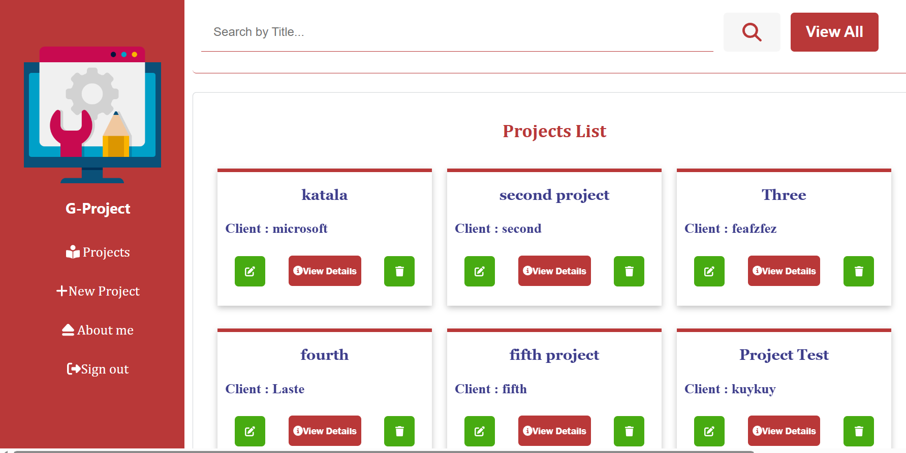

# G-Projects

G-Projects is a project management application that allows users to effectively manage their projects. This README provides an overview of the project and instructions for getting started.

## Features

- User Authentication .
- Project Creation: Users can create new projects by providing details such as title, description, and start/end dates.
- File Management: Users can upload and manage files associated with each project.
- Collaboration: Users can collaborate within projects by sharing updates, comments, and files.
- Task Tracking: Users can create and track tasks within projects to manage project progress.

  

## Technologies Used

- Frontend: HTML, CSS, JavaScript
- Backend: PHP (OOP) ,  MySQL
- Other: File handling, database management

## Usage

1. Log in.
2. Create new projects and provide necessary details.
3. Upload files, manage tasks, and collaborate with other users within the project.
4. Explore the various features to effectively manage your projects.

## Contribution

Contributions are welcome! If you encounter issues or want to enhance the application, feel free to create a pull request.

## Contact

For any questions or inquiries, please contact me at mouad.khartouch20@ump.ac.ma
